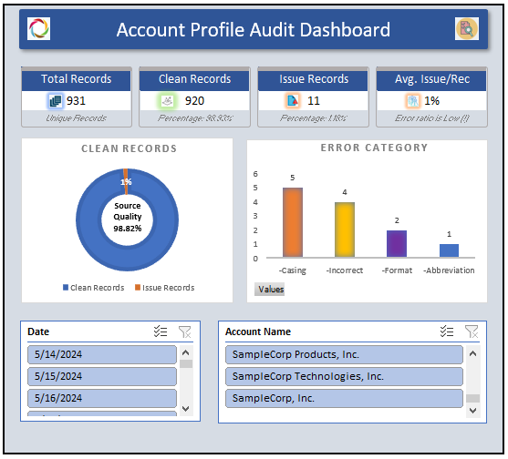

# 📊 Account Profile Audit – Excel Data Quality Project

## 📌 Project Overview
This project focuses on auditing and improving account profile data quality using Microsoft Excel. The solution identifies and tracks common data issues such as casing inconsistencies, abbreviations, incorrect formatting, invalid country codes, and address standardization problems.

The project simulates a real-world business data audit process commonly used in CRM systems, customer master databases, and operational reporting environments.

---

# 🎯 Project Objectives

The primary goals of this project are:

- Improve account data consistency
- Identify data quality issues through audit rules
- Standardize account-related information
- Create a reusable audit framework in Excel
- Build an interactive dashboard for issue tracking

#### 📌 Refer the "[AuditLogicFile](docs/audit_logic.md)" document that explains the audit validation rules, business logic, and Excel formulas used in the Account Profile Audit project.
---

# 🛠 Tools & Techniques Used

## Tools
- Microsoft Excel
- Charts
- Slicers
- Conditional Formatting
- Data Validation

## Excel Functions Used
- IF
- SUMPRODUCT
- COUNTIF
- PROPER
- TRIM
- CLEAN
- VLOOKUP
- FILTER
- SEARCH
- ISBLANK

---

# 📂 Workbook Structure

| Sheet Name | Description |
|---|---|
| `Dashboard` | Interactive audit dashboard with KPIs and charts |
| `Account_Profile_Audit` | Main audit dataset with validation flags |
| `Audit Description` | Explanation of audit checks and business logic |
| `Guidelines` | Data audit standards and usage instructions |
| `Country Codes` | Reference table for country validation |

---

# 🔍 Audit Checks Implemented

| Audit Check | Description |
|---|---|
| Casing Validation | Detects improper account name casing |
| Abbreviation Check | Identifies inconsistent abbreviations |
| Format Validation | Detects formatting inconsistencies |
| Duplicate Detection | Flags duplicate account entries |
| Country Code Validation | Validates country codes against reference list |
| Address Standardization | Reviews address formatting consistency |

---

# 📊 Dashboard Features

The dashboard provides a high-level summary of data quality issues and allows users to analyze audit results dynamically.

## Included Visuals
- Error Distribution Chart
- Clean vs Review Required Records
- Top Audit Issues
- Interactive Dashboard

## KPI Metrics
- Total Records
- Records with Issues
- Clean Records
- Percentage of Clean Data
- Average Issues per Record

---

# 🧠 Business Value

Poor account data quality can create several business problems, including:

- Incorrect reporting and analytics
- CRM inconsistencies
- Operational inefficiencies

This audit framework helps organizations improve data governance and maintain reliable master data.

---

# 🚀 Key Highlights

✅ Interactive Excel dashboard

✅ Rule-based data validation approach

✅ Dynamic charts and KPI reporting

✅ Business-focused data quality analysis

---

# 📷 Dashboard Preview



---

# 📁 Suggested Repository Structure

```text
account-profile-audit-excel/
├── docs/
    └── audit-logic.md
├── images/
│   └── dashboard.png
├── README.md
└── Account Profile Audit.xlsx│
    
```

---

# ▶️ How to Use

1. Download the Excel workbook
2. Open the `Dashboard` sheet
3. Review audit logic in the `Audit_Description` sheet
4. Analyze flagged records in `Account_Profile_Audit`

---

# Author

Hemanraj Mani

---

# ⭐ Project Purpose

This project was created as part of a data analytics portfolio to demonstrate:

- Excel data cleaning skills
- Data quality auditing techniques
- Dashboard development
- Business problem-solving ability
- Reporting and visualization skills

